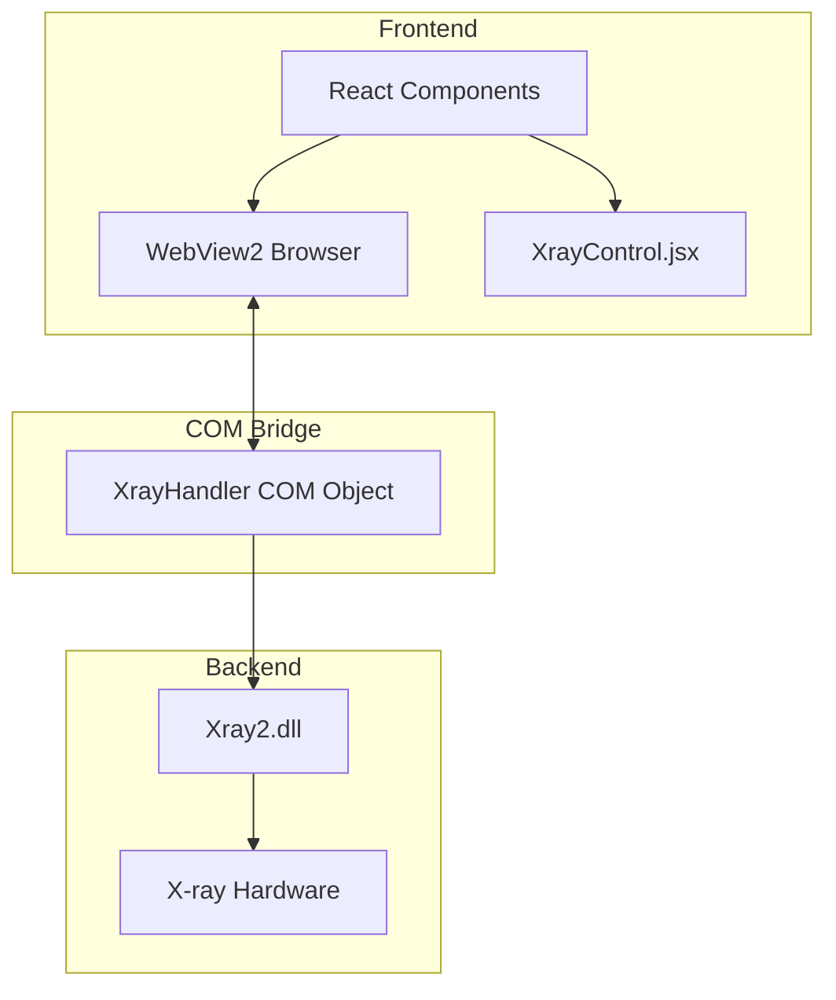
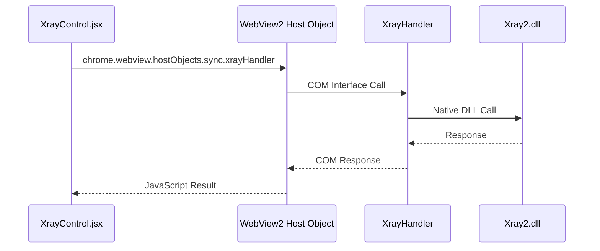

#  XrayControl前后端通过Webview2联通实现

## 1. 系统架构概述

### 1.1 整体架构图


### 1.2 通信流程图


> 1. 请求发起
>    - `XrayControl.jsx` 通过 WebView2 提供的 `hostObjects` 接口发起调用
>    - 使用 `sync` 模式确保同步调用
> 2. 中间层处理
>    - `WebView2 Host Object` 将 JavaScript 调用转换为 COM 调用
>    - `XrayHandler` 接收 COM 调用并进行参数处理
> 3. 后端执行
>    - `Xray2.dll` 执行实际的硬件控制操作
>    - 返回执行结果
> 4. 响应返回
>    - 结果通过相反的路径返回到前端
>    - 每一层都进行必要的数据转换和封装


## 2. 技术实现细节

### 2.1 前端实现 (React)
前端采用 React 组件化开发，关键实现包括：

- **状态管理**：
```javascript
const [xrayState, setXrayState] = useState({
    isPowered: false,
    isWarmedUp: false,
    voltage: 130,
    current: 300,
    focus: 0,
    status: "XR_NOT_READY"
});
```

- **WebView2 通信接口**：
```javascript
const handler = window.chrome?.webview?.hostObjects?.sync?.xrayHandler;
```

- **属性访问方式**：
  - 无参数方法：`await handler.turnOn`
  - 属性设置：`handler.Voltage = newVoltage`
  - 状态获取：`await handler.getStatus`

### 2.2 中间层实现 (WebView2 COM Bridge)

- **XrayHandler 类注册**：
```cpp
class XrayHandler : public Microsoft::WRL::RuntimeClass
    Microsoft::WRL::RuntimeClassFlags<Microsoft::WRL::ClassicCom>,
    IDispatch>
```

- **方法映射表**：
```cpp
static const struct {
    const wchar_t* name;
    DISPID id;
} methods[] = {
    {L"initialize", 1},
    {L"startWarmup", 2},
    {L"setVoltage", 3},
    // ...
    {L"Voltage", 11},
    {L"Current", 12}
};
```

### 2.3 后端实现 (Native)

- **DLL 加载与初始化**：
```cpp
bool XrayHandler::LoadXrayDll() {
    m_hXrayDll = LoadLibrary(L"Xray2.dll");
    // ...
}
```

- **X-ray 控制接口**：
```cpp
BOOL CXray::SetkV(UINT kV)
BOOL CXray::SetuA(UINT uA)
BOOL CXray::TurnOn()
BOOL CXray::TurnOff()
```

## 3. 关键功能实现

### 3.1 电压和电流控制
前端通过属性设置方式进行控制：
```javascript
handler.Voltage = newVoltage;
handler.Current = newCurrent;
```

后端通过 COM 接口处理：
```cpp
case 11: // Voltage property
    if (wFlags & DISPATCH_PROPERTYPUT) {
        UINT kV = static_cast<UINT>(pDispParams->rgvarg[0].intVal);
        return m_xray->SetkV(kV) ? S_OK : E_FAIL;
    }
```

### 3.2 状态同步
使用 JSON 格式进行状态传递：
```cpp
json << "{"
    << "\"status\":\"" << stateStr << "\","
    << "\"isPowered\":" << (m_xray->IsBeamOn() ? "true" : "false")
    // ...
    << "}";
```

