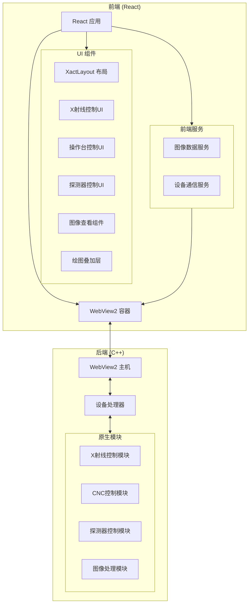
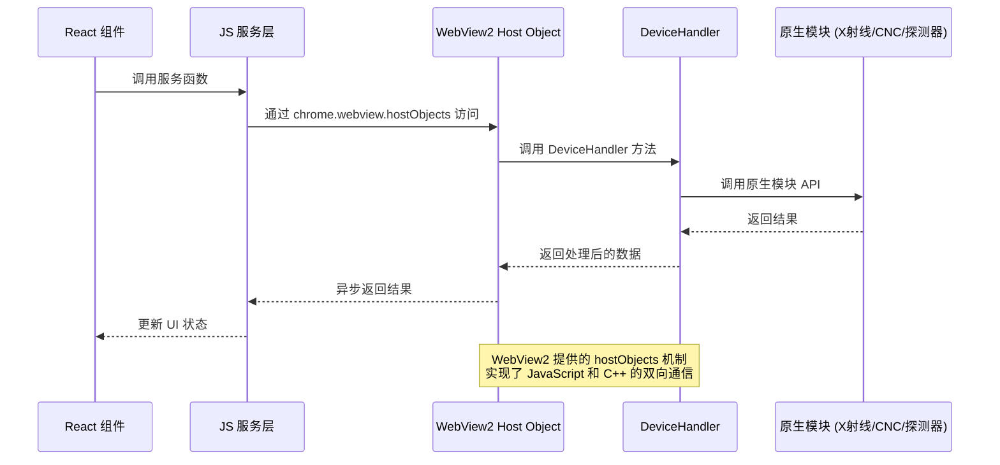
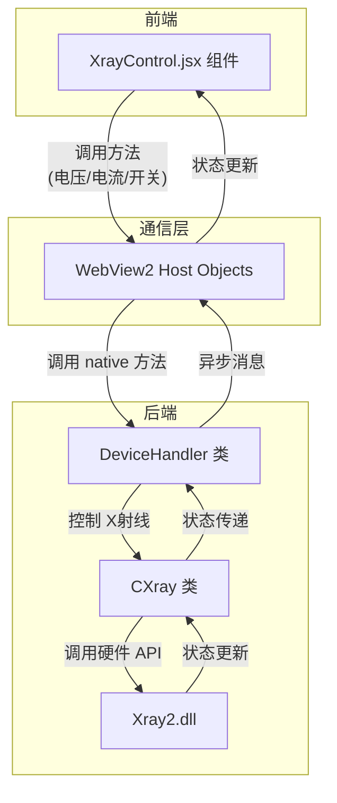
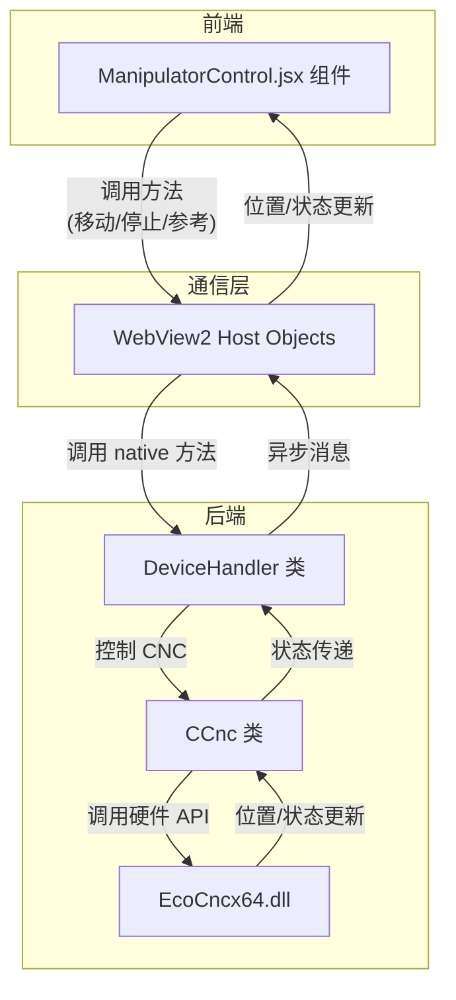
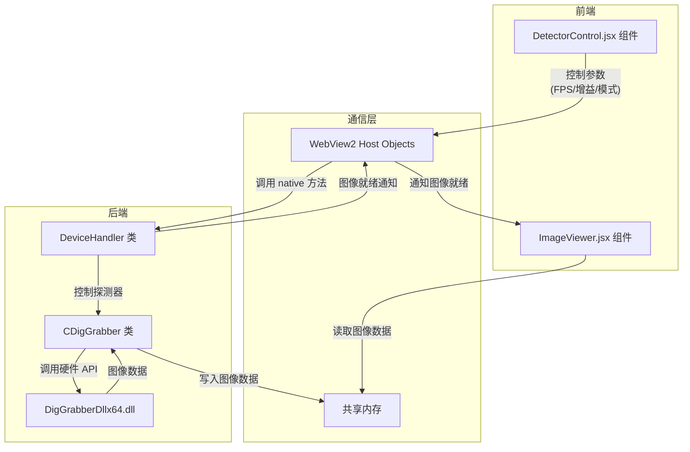

# X|act 系统汇报报告

## 1. 项目概述

本项目是对 Baker Hughes 旗下 X|act 系统的重构升级，采用 React 前端框架替代原有 MFC/Qt 界面，同时保留原有 C++ 后端功能模块。项目旨在提供现代化的用户界面和交互体验，同时保持与原有 X 射线控制、CNC 控制、探测器控制和图像处理功能的完整兼容性。

新系统的设计目标是：
1. 提供更直观、美观的用户界面
2. 改善用户交互体验
3. 增强系统模块化和可维护性
4. 保持与原有功能和硬件的兼容性

## 2. 系统架构

### 2.1 总体架构图



### 2.2 前后端通信架构



### 2.3 X射线控制架构



### 2.4 CNC控制架构



### 2.5 探测器控制架构



## 3. 核心功能模块

### 3.1 X射线控制模块

#### 旧系统功能
- 基本的X射线开关控制
- 电压/电流参数控制
- 状态指示
- 预热功能
- 聚焦模式选择

#### 新系统改进
- **直观的状态可视化**：使用颜色编码清晰显示X射线状态
- **浮动控制面板**：可随时调整位置的控制面板，方便操作
- **参数实时反馈**：输入参数后实时计算和显示功率值
- **折叠式面板**：可折叠的控制面板节省界面空间
- **可拖拽定位**：面板可拖拽到用户期望的任何位置
- **简化的聚焦控制**：更直观的模式选择界面

```javascript
// XrayControl.jsx 核心功能示例
const [xrayState, setXrayState] = useState({
  isPowered: false,
  isWarmedUp: false,
  voltage: 130,
  current: 300,
  focus: 0,
  status: "XR_NOT_READY",
});

// 通过 WebView2 与后端通信
const handlePowerToggle = async () => {
  try {
    const handler = window.chrome?.webview?.hostObjects?.deviceHandler;
    if (!handler) throw new Error("Device handler not available");

    if (!xrayState.isPowered) {
      await handler.turnXrayOn;
    } else {
      await handler.turnXrayOff;
    }
    await updateStatus();
  } catch (err) {
    console.error("Power toggle failed:", err);
    setWarningMessage(err.message);
    setShowWarning(true);
  }
};
```

### 3.2 CNC控制模块

#### 旧系统功能
- 基本的轴控制
- 位置显示
- 参考功能
- 摇杆启用/禁用
- 碰撞保护

#### 新系统改进
- **直观的位置输入**：点击位置显示可直接输入目标位置
- **响应式布局**：基于网格的轴控制布局，提供更好的可视组织
- **简化的参考流程**：一键参考功能，并提供视觉反馈
- **状态可视化**：使用图标和颜色直观显示CNC状态
- **紧凑的控制面板**：可折叠的控制区域节省空间

```javascript
// ManipulatorControl.jsx 核心功能示例
const handleMove = async () => {
  if (editingAxis === null || moveValue === "") return;

  try {
    const handler = getHandler();
    if (!handler) throw new Error("Device handler not available");

    const axis = parseInt(editingAxis);
    const moveVal = parseFloat(moveValue);
    
    const moveResult = await handler.moveAxis(axis, moveVal);
    await updateStatus();
    setEditingAxis(null);
    setMoveValue("");
  } catch (err) {
    console.error("Move operation failed:", err);
    setError(err.message);
  }
};
```

### 3.3 探测器控制模块

#### 旧系统功能
- 实时图像采集
- 图像积分
- 帧率控制
- 增益控制
- 滤镜应用

#### 新系统改进
- **模块化设计**：采集、显示、处理分离为独立区块
- **可折叠面板**：各功能区可折叠，方便管理界面空间
- **直观的图像处理链**：滤镜处理链可视化展示
- **实时直方图**：图像灰度直方图实时显示
- **增强的控制滑块**：更精确的参数控制滑块

```javascript
// DetectorControl.jsx 核心功能示例
const toggleLive = async () => {
  setAcquisitionState((prev) => {
    const newState = { ...prev, isLive: !prev.isLive };

    if (newState.isLive) {
      startLiveCapture();
    } else {
      stopLiveCapture();
    }

    return newState;
  });
};

const startLiveCapture = () => {
  captureInterval = setInterval(async () => {
    try {
      const imageData = await imageDataService.getImageData(1024, 1024);
      // 处理获取到的图像数据
    } catch (error) {
      console.error("Live capture error:", error);
      stopLiveCapture();
    }
  }, 1000 / acquisitionState.fps);
};
```

### 3.4 图像展示与标注模块

#### 旧系统功能
- 基本图像显示
- 简单的缩放旋转
- 基本标注工具
- 单视图/四视图切换

#### 新系统改进
- **高性能渲染**：使用 PixiJS 渲染引擎，支持高性能图像处理
- **流畅的绘图叠加层**：基于 Canvas 的高性能绘图叠加层
- **丰富的绘图工具**：箭头、线条、矩形、圆形、文本等多种标注工具
- **直观的工具栏**：浮动式绘图工具栏，随时可用
- **灵活的视图控制**：可自由调整的图像控制器

```javascript
// ImageViewer.jsx 核心功能示例
useEffect(() => {
  const initPixiApp = async () => {
    try {
      if (pixiContainerRef.current) {
        const app = new PIXI.Application();
        await app.init({
          width: pixiContainerRef.current.clientWidth,
          height: pixiContainerRef.current.clientHeight,
          backgroundColor: 0x000000,
          antialias: true,
          powerPreference: "high-performance",
          resizeTo: pixiContainerRef.current,
        });

        pixiAppRef.current = app;
        pixiContainerRef.current.appendChild(app.canvas);

        const [imageData, width, height] = await imageDataService.getImageData();
        if (imageData && width && height) {
          // 创建和渲染图像...
        }
      }
    } catch (error) {
      console.error("Error initializing PixiJS:", error);
    }
  };

  initPixiApp();
};
```

## 4. 新旧系统对比

### 4.1 用户界面对比

| 功能/特性  | 旧系统                       | 新系统                             | 优势                         |
| ---------- | ---------------------------- | ---------------------------------- | ---------------------------- |
| 整体布局   | 固定式布局，功能区域不可调整 | 响应式布局，支持折叠展开与浮动窗口 | 提高空间利用率，增强用户体验 |
| 控制面板   | 固定位置，不可移动           | 可拖拽浮动窗口，任意调整位置       | 灵活性更高，适应不同工作流程 |
| 视觉风格   | 传统Windows风格，灰色基调    | 现代化设计，清晰的颜色编码与图标   | 更直观美观，降低学习成本     |
| 功能区组织 | 层级深，需要多次点击         | 扁平化设计，折叠面板快速访问       | 提高操作效率，减少点击次数   |
| 图像处理   | 固定工具栏，占用界面空间     | 浮动工具栏，按需显示               | 专注于图像观察，降低干扰     |

### 4.2 技术架构对比

| 功能/特性  | 旧系统       | 新系统                   | 优势                             |
| ---------- | ------------ | ------------------------ | -------------------------------- |
| 前端框架   | MFC/Qt (C++) | React (JavaScript)       | 开发效率高，组件化复用，生态丰富 |
| 渲染引擎   | GDI/DirectX  | WebGL (PixiJS)           | 高性能图像渲染，GPU加速          |
| UI组件     | 定制控件     | React组件 + Tailwind CSS | 快速开发，一致的视觉风格         |
| 前后端通信 | 紧耦合 C++   | WebView2 桥接            | 解耦前后端，独立开发与测试       |
| 代码组织   | 模块化较弱   | 完全组件化               | 更好的可维护性与可扩展性         |
| 状态管理   | 分散管理     | React Hooks集中管理      | 状态变化可预测，调试更简单       |

### 4.3 性能对比

| 功能/特性 | 旧系统  | 新系统            | 优势                 |
| --------- | ------- | ----------------- | -------------------- |
| 启动时间  | 较快    | 略慢但可接受      | 功能集成度更高       |
| 图像渲染  | 较好    | 优秀（WebGL加速） | 大图像处理更流畅     |
| 内存占用  | 较低    | 略高但稳定        | 功能更丰富，体验更好 |
| 响应速度  | 良好    | 良好              | 保持系统响应性       |
| 图像处理  | CPU密集 | GPU加速           | 处理大图像更快       |

## 5. 技术实现重点

### 5.1 WebView2与C++后端通信

新系统采用WebView2作为前端容器，通过其提供的hostObjects机制实现JavaScript与C++代码的双向通信。

```cpp
// DeviceHandler.cpp 核心部分
STDMETHODIMP DeviceHandler::Invoke(DISPID dispIdMember, REFIID riid, LCID lcid,
    WORD wFlags, DISPPARAMS* pDispParams, VARIANT* pVarResult,
    EXCEPINFO* pExcepInfo, UINT* puArgErr)
{
    try {
        switch (dispIdMember) {
            // X射线方法
            case 1: // initializeXray
                return m_xray->Open() ? S_OK : E_FAIL;
            case 5: // turnXrayOn
                return m_xray->TurnOn() ? S_OK : E_FAIL;
            case 6: // turnXrayOff
                return m_xray->TurnOff() ? S_OK : E_FAIL;
            // CNC方法
            case 102: // startReference
                return m_cnc->StartReference() ? S_OK : E_FAIL;
            // 更多方法...
        }
        return S_OK;
    }
    catch (...) {
        return E_FAIL;
    }
}
```

### 5.2 图像数据传输

图像数据通过共享内存实现高效传输，避免了大量数据通过WebView2接口传递的性能瓶颈。

```cpp
// DeviceHandler.cpp 共享内存实现
HRESULT DeviceHandler::ReadSharedMemory(BSTR name, UINT size, VARIANT* pResult) {
    try {
        if (!m_imageBuffer.mappedAddress) {
            return E_FAIL;
        }

        // 创建 SafeArray
        SAFEARRAYBOUND bounds[1];
        bounds[0].lLbound = 0;
        bounds[0].cElements = size;

        SAFEARRAY* psa = SafeArrayCreate(VT_UI1, 1, bounds);
        if (!psa) return E_OUTOFMEMORY;

        void* pData;
        HRESULT hr = SafeArrayAccessData(psa, &pData);
        if (FAILED(hr)) {
            SafeArrayDestroy(psa);
            return hr;
        }

        // 复制数据
        memcpy(pData, m_imageBuffer.mappedAddress, size);
        SafeArrayUnaccessData(psa);

        // 设置返回值
        VariantInit(pResult);
        pResult->vt = VT_ARRAY | VT_UI1;
        pResult->parray = psa;

        return S_OK;
    }
    catch (...) {
        return E_FAIL;
    }
}
```

### 5.3 图像渲染引擎

采用PixiJS作为图像渲染引擎，利用WebGL加速图像渲染，保证大图像的流畅显示。

```javascript
// ImageViewer.jsx 渲染引擎初始化
const initPixiApp = async () => {
  try {
    const app = new PIXI.Application();
    await app.init({
      width: pixiContainerRef.current.clientWidth,
      height: pixiContainerRef.current.clientHeight,
      backgroundColor: 0x000000,
      antialias: true,
      clearBeforeRender: true,
      powerPreference: "high-performance",
      hello: true,
      resizeTo: pixiContainerRef.current,
    });

    pixiAppRef.current = app;
    pixiContainerRef.current.appendChild(app.canvas);

    // 加载和渲染图像...
  } catch (error) {
    console.error("Error initializing PixiJS:", error);
  }
};
```

### 5.4 实时状态监控

通过WebView2消息机制实现设备状态实时监控，保持前端UI与后端状态同步。

```cpp
// DeviceHandler.cpp 监控线程
void DeviceHandler::MonitorThreadFunc() {
    while (m_isMonitoring) {
        try {
            std::lock_guard<std::mutex> lock(m_mutex);

            if (!m_cnc || !m_xray || !m_webView) {
                std::this_thread::sleep_for(std::chrono::milliseconds(200));
                continue;
            }

            // 获取CNC状态
            VARIANT cncStatus;
            VariantInit(&cncStatus);
            if (m_cnc) {
                HRESULT hr = GetCncStatus(&cncStatus);
                if (SUCCEEDED(hr)) {
                    m_webView->PostWebMessageAsJson(cncStatus.bstrVal);
                    VariantClear(&cncStatus);
                }
            }

            // 获取Xray状态...
        }
        catch (...) {
            OutputDebugString(L"Unknown error in monitor thread\n");
        }

        std::this_thread::sleep_for(std::chrono::milliseconds(200));
    }
}
```

## 6. 改进与创新点

### 6.1 UI/UX改进

1. **浮动式控制面板**
   - 可拖拽的X射线控制面板，支持折叠/展开
   - 可自由调整位置，适应不同工作场景

2. **分区折叠式布局**
   - 探测器控制区分为"采集"、"显示"、"处理"三个可独立折叠的区域
   - 根据工作流程需要，保持相关控件可见，隐藏不需要的区域

3. **直观的状态显示**
   - 清晰的颜色编码和图标指示系统状态
   - 直观的进度条和状态指示器

4. **简化的复杂操作**
   - 重新设计的参数输入流程，减少操作步骤
   - 一键操作替代多步骤流程

### 6.2 技术创新

1. **前后端分离架构**
   - 使用WebView2作为桥接层，实现前后端解耦
   - 保留原有C++后端，最小化改造成本

2. **高性能图像处理**
   - 结合WebGL和共享内存实现高性能图像处理
   - 优化的渲染流程确保大图像处理流畅

3. **组件化设计**
   - 完全组件化的UI设计，支持灵活重组
   - 每个功能模块都是独立的React组件

4. **响应式设计**
   - 适应不同屏幕尺寸和分辨率
   - 动态调整布局满足不同使用场景

## 7. 总结与展望

### 7.1 项目成果

本项目成功实现了X|act系统的现代化升级，通过采用React前端框架和WebView2技术，在保留原有C++后端功能的同时，提供了更直观、美观和高效的用户界面。主要成果包括：

1. 全新的用户界面，提供了更好的交互体验
2. 保持与原有功能的完全兼容
3. 前后端分离架构，提高系统可维护性
4. 性能优化，确保大图像处理流畅

### 7.2 未来展望

未来计划进一步完善和扩展系统功能：

1. **更多高级图像处理功能**
   - 集成机器学习算法进行缺陷检测
   - 支持3D重建与可视化

2. **跨平台支持**
   - 扩展到移动设备远程监控
   - 支持云端部署与远程访问

3. **扩展模块化插件系统**
   - 开放插件API，支持第三方功能扩展
   - 自定义工作流程编排

4. **增强数据管理与分析**
   - 集成数据库存储检测结果
   - 提供高级分析与报告生成功能

---

